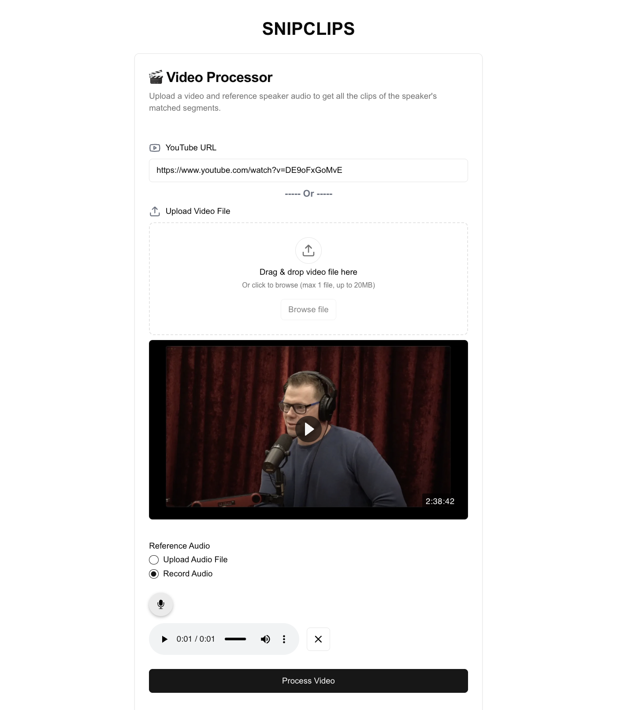

<h1 style="text-align:center">SNIPCLIPS</h1>
<p>Get all your clips from a video(with multiple speakers) by adding a reference audio.</p>



### Run the client

Install dependencies

```bash
cd client && yarn
```

Start server

```bash
yarn dev
```

### Run the backend server

```bash
cd server
```

Add `.env`. Check `env.example`.

Install dependencies

```bash
pip install -r requirements.txt
```

Start server

```bash
python3 -m venv .venv
source .venv/bin/activate
flask run --port=5000 --reload
```
